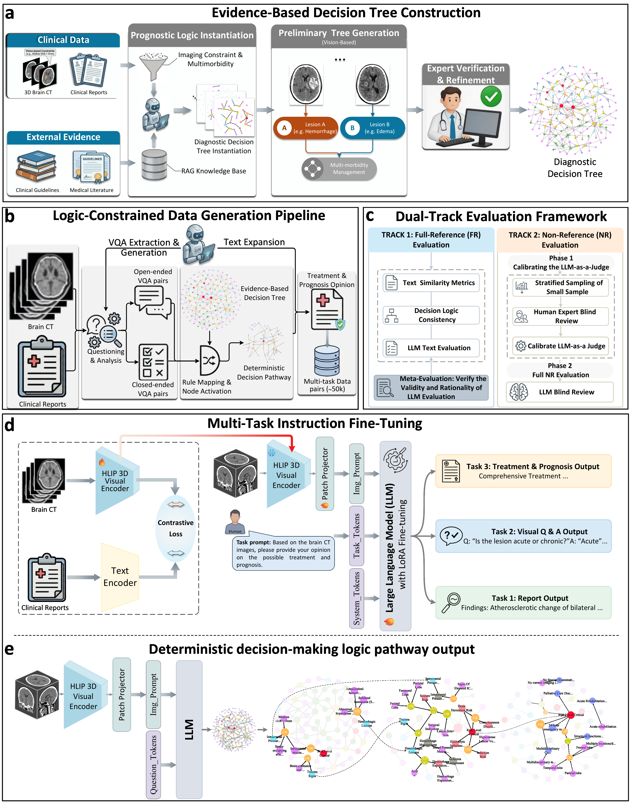

# GCVLM-Brain

**A Guideline-Constrained Vision-Language Foundation Model for Verifiable 3D Brain CT Reasoning**

Xiaofei Huang\*, Jie Liu\*, Jiansong Zhang, Zhuoqin Yang, Xiaoling Luo, Hsin-Yu Wu, Cheng-Yi Li, Feng Lirng, Yu-Chieh Ko, Juan Yu, Wenting Chen\*, Kao-Jung Chang\*, Linlin Shen\*

*: Contributed equally (co-first)  \*: Corresponding author

Shenzhen University · City University of Hong Kong · National Yang Ming Chiao Tung University · Stanford University · Shenzhen Second People's Hospital

---

## Overview

GCVLM-Brain is a unified 3D vision-language foundation model that grounds clinical reasoning in evidence-based medicine for brain CT analysis. The model integrates an **HLIP 3D visual encoder** with a **Qwen3-8B** language backbone via **LoRA** fine-tuning, enabling end-to-end reasoning from volumetric CT perception to treatment prognosis within a single architecture.

The core innovation is a **deterministic, six-tier decision tree** that encodes authoritative clinical guidelines (evidence levels 1a–5) as computable prior knowledge. This constrains model outputs to verifiable imaging evidence—treatment recommendations are traceable to specific guideline clauses rather than statistical extrapolations from unstructured report corpora. The model is trained on a large-scale multi-task dataset of over 520,000 clinically traceable samples spanning report generation, visual question answering, and imaging-driven treatment prognosis.



## Key Features

- **Evidence-Based Reasoning Prior**: Six-tier deterministic decision tree translates clinical guidelines into computable state-transition logic, enforcing imaging-feature-grounded outputs
- **Multi-Task Joint Training**: Single architecture handles report generation, open/closed VQA, and treatment & prognosis generation (~522K samples, 18,894 CT scans)
- **Dual-Track Evaluation Framework**: Full-reference (FR) assessment anchored to decision-tree ground truth + Non-reference (NR) clinical utility scoring calibrated against expert radiologists (ICC=0.87, p<0.001)
- **Cross-Centre Generalization**: Zero-shot validation on external multicentre CQ500 dataset (491 scans, 3 scanner vendors)
- **Meta-Validated Safety Metrics**: Perturbation testing confirms evaluation criteria are differentially sensitive to high-risk clinical errors (overall score drop of 1.32 for incorrect risk-level outputs, p<0.001)

## Model Architecture

```
                            ┌──────────────────────────────┐
  3D CT Volume (D×H×W) ──►│  HLIP 3D Visual Encoder       │
                            │  (Hierarchical Attention ViT)  │
                            └──────────┬───────────────────┘
                                       │ 3D Visual Tokens
                                       ▼
                            ┌──────────────────────────────┐
                            │  MLP Projector (LoRA)         │
                            └──────────┬───────────────────┘
                                       │ Projected Embeddings
                                       ▼
                            ┌──────────────────────────────┐
                            │  Qwen3-8B LLM (LoRA)         │
                            └──────────┬───────────────────┘
                                       │
                    ┌──────────────────┼──────────────────┐
                    ▼                  ▼                  ▼
            Report Generation    Open/Closed VQA    Treatment & Prognosis
                                                       │
                                          ┌────────────▼────────────┐
                                          │  Six-Tier Decision Tree  │
                                          │  (Deterministic Logic)   │
                                          └─────────────────────────┘
```

**Training Strategy:**
- **Stage 1**: HLIP visual encoder pretrained via contrastive learning on large-scale 3D image–report pairs. Visual features are aligned with clinical text representations.
- **Stage 2**: Modality projection + multi-task instruction fine-tuning. The pretrained encoder is frozen; LoRA (r=64, α=128) is applied exclusively to the projector and language model.

## Getting Started

### Installation

```bash
git clone https://github.com/xxx/GCVLM-Brain.git
cd GCVLM-Brain

conda create -n gcvlm python=3.10
conda activate gcvlm

# PyTorch with CUDA 12.1
pip install torch==2.3.0 torchvision==0.18.0 --index-url https://download.pytorch.org/whl/cu121

pip install -r requirements.txt
```

### Stage 1: HLIP Visual Encoder Pretraining

Pretrain the 3D visual encoder via contrastive learning on image–report pairs.

```bash
bash scripts/train_hlip.sh
```

### Stage 2: Multi-Task Instruction Fine-Tuning

Jointly fine-tune the projector and LLM on the mixed instruction dataset. The visual encoder remains frozen; LoRA is applied exclusively to the projector and language model.

```bash
# Single GPU
bash scripts/lora_hlip_vlm_single.sh

# Multi-GPU with DeepSpeed ZeRO-2
bash scripts/lora_hlip_vlm.sh
```

### Merging LoRA Weights

After fine-tuning, merge LoRA adapters into the base model and save in HuggingFace format:

```bash
python src/utils/merge_hlip_lora_weights_v2.py \
    --model_name_or_path output/qwen3-8b \
    --model_with_lora ./output/model_with_lora.bin \
    --output_dir ./output/merged_model
```

### Evaluation

```bash
# Report generation
bash scripts/eval/eval_report_generation.sh

# Open-ended VQA
bash scripts/eval/eval_open_vqa.sh

# Closed-ended VQA
bash scripts/eval/eval_closed_vqa.sh

# Treatment & prognosis
bash scripts/eval/eval_treatment_prognosis.sh
```

## Datasets

| Task | Sub-task | CT Scans | QA Pairs |
|------|----------|----------|----------|
| Report Generation | — | 18,894 | 18,894 |
| Visual Question Answering | Open-ended | 18,894 | 245,622 |
| Visual Question Answering | Closed-ended | 18,894 | 207,834 |
| Treatment & Prognosis | — | 18,894 | ~50,000 |
| **Total** | | **18,894** | **~522,350** |

- **Internal Cohort (BrainCT)**: 18,894 brain CT scans from Taipei Veterans General Hospital (2010–2022). 13,226 scans for training, 1,889 for testing.
- **External Cohort (CQ500)**: 491 multi-scanner head CTs (GE, Philips, Siemens), publicly available at [Kaggle](https://www.kaggle.com/datasets/crawford/qureai-headct).

> The internal 3D brain CT dataset is not publicly available due to privacy protection. For further details, refer to the BrainGPT study ([doi:10.1038/s41467-025-57426-0](https://doi.org/10.1038/s41467-025-57426-0)).

## Results

### Treatment & Prognosis Generation (3D-Brain-CT)

**Full-Reference (FR) — Basic Text Similarity**

| Model | BLEU | ROUGE-L | METEOR | BERTScore | DocLens Recall | DocLens Precision |
|-------|------|---------|--------|-----------|----------------|-------------------|
| RadFM | 0.501 | 0.565 | 0.498 | 0.832 | 0.549 | 0.602 |
| M3D | 0.524 | 0.584 | 0.415 | 0.845 | 0.556 | 0.625 |
| Med3DVLM | 0.537 | 0.599 | 0.427 | 0.869 | 0.571 | 0.639 |
| **GCVLM-Brain** | **0.606** | **0.627** | **0.527** | **0.934** | **0.655** | **0.663** |

**Full-Reference (FR) — Decision-Logic Consistency**

| Model | Precision | Recall | F1 Score |
|-------|-----------|--------|----------|
| RadFM | 0.6341 | 0.6249 | 0.6246 |
| M3D | 0.6714 | 0.6438 | 0.6534 |
| Med3DVLM | 0.7245 | 0.7122 | 0.7023 |
| **GCVLM-Brain** | **0.8723** | **0.8486** | **0.8603** |

**Full-Reference (FR) — LLM-Based Multi-Dimensional Clinical Quality (6-dim)**

| Model | Coverage | Faithfulness & Accuracy | Granularity | Clinical Reasoning | Risk Stratification Accuracy | Clinical Validity | Overall |
|-------|----------|------------------------|-------------|-------------------|------------------------------|-------------------|---------|
| RadFM | 2.69 | 1.79 | 3.01 | 2.60 | 3.95 | 2.35 | 2.72 |
| M3D | 2.79 | 1.89 | 3.06 | 2.70 | 4.07 | 2.58 | 2.85 |
| Med3DVLM | 2.91 | 2.09 | 3.11 | 2.86 | 4.19 | 2.86 | 3.02 |
| **GCVLM-Brain** | **3.09** | **2.40** | **3.19** | **3.04** | **4.32** | **3.18** | **3.25** |

**Non-Reference (NR) — Expert-Calibrated Clinical Utility (5-pt Likert)**

| Model | Clinical Accuracy & Completeness | Risk Stratification & Severity | Clinical Feasibility & Decision Value | Overall Quality |
|-------|------|------|------|------|
| RadFM | 3.13 | 2.39 | 3.00 | 2.40 |
| M3D | 4.00 | 2.25 | 3.15 | 2.63 |
| Med3DVLM | 4.02 | 3.49 | 3.96 | 3.74 |
| **GCVLM-Brain** | **4.18** | **3.63** | **4.34** | **4.08** |

### Visual Question Answering (3D-Brain-CT)

**Closed-Ended VQA**

| Model | Accuracy | Jaccard Index |
|-------|----------|---------------|
| RadFM | 0.356 | 0.556 |
| M3D | 0.369 | 0.559 |
| Med3DVLM | 0.398 | 0.589 |
| **GCVLM-Brain** | **0.499** | **0.672** |

**Open-Ended VQA**

| Model | BLEU | ROUGE-L | METEOR | BERTScore | DocLens Recall | DocLens Precision | MSE ↓ |
|-------|------|---------|--------|-----------|----------------|-------------------|-------|
| RadFM | 0.431 | 0.462 | 0.441 | 0.852 | 0.398 | 0.486 | 14.329 |
| M3D | 0.452 | 0.469 | 0.458 | 0.866 | 0.401 | 0.487 | 13.462 |
| Med3DVLM | 0.460 | 0.502 | 0.460 | 0.881 | 0.443 | 0.501 | 10.506 |
| **GCVLM-Brain** | **0.516** | **0.537** | **0.535** | **0.936** | **0.492** | **0.554** | **8.439** |

### Report Generation (3D-Brain-CT)

| Model | BLEU | ROUGE-L | METEOR | BERTScore | DocLens Recall | DocLens Precision |
|-------|------|---------|--------|-----------|----------------|-------------------|
| RadFM | 0.221 | 0.308 | 0.243 | 0.812 | 0.298 | 0.346 |
| M3D | 0.246 | 0.315 | 0.248 | 0.822 | 0.299 | 0.365 |
| Med3DVLM | 0.265 | 0.331 | 0.283 | 0.856 | 0.343 | 0.399 |
| **GCVLM-Brain** | **0.278** | **0.344** | **0.295** | **0.867** | **0.389** | **0.439** |

### Zero-Shot External Validation (CQ500) — Non-Reference Clinical Utility

| Model | Clinical Accuracy & Completeness | Risk Stratification & Severity | Clinical Feasibility & Decision Value | Overall Quality |
|-------|------|------|------|------|
| RadFM | 2.61 | 2.39 | 2.74 | 2.25 |
| M3D | 3.36 | 3.40 | 3.79 | 3.44 |
| Med3DVLM | 3.08 | 3.22 | 3.81 | 3.25 |
| **GCVLM-Brain** | **3.98** | **4.05** | **3.87** | **3.96** |

> All baseline models were co-fine-tuned on the identical ~522K-sample multitask dataset using each model's officially recommended strategy, isolating architectural differences as the primary comparison axis.

## Implementation Details

| Stage | Parameter | Value |
|-------|-----------|-------|
| **Visual Encoder Pretraining** | Optimizer | AdamW |
| | Learning Rate | 1×10⁻⁴ |
| | Batch Size / Epochs | 32 / 10 |
| **Multi-Task Fine-Tuning** | LR Schedule | Cosine decay |
| | Initial Learning Rate | 5×10⁻⁵ |
| | Linear Warmup Steps | 100 |
| | Batch Size | 16 |
| | LoRA Rank / α | 64 / 128 |
| | LoRA Dropout | 0.05 |
| | Hardware | 2× NVIDIA A100 (80 GB) |

## Citation

If you find this work useful, please cite:

```bibtex
@article{huang2025gcvlm,
  title={A Guideline-Constrained Vision-Language Foundation Model for Verifiable 3D Brain CT Reasoning},
  author={Huang, Xiaofei and Liu, Jie and Zhang, Jiansong and Yang, Zhuoqin and Luo, Xiaoling and Wu, Hsin-Yu and Li, Cheng-Yi and Lirng, Feng and Ko, Yu-Chieh and Yu, Juan and Chen, Wenting and Chang, Kao-Jung and Shen, Linlin},
  year={2025}
}
```

## License

This project is released under the [MIT License](LICENSE).
